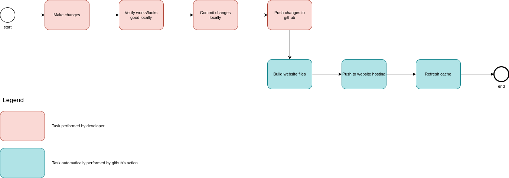

# Helipoland

Helipoland.com is a static website generated by [hugo](https://gohugo.io/), hosted on s3 and served by cdn provider (not selected yet). [Tailwind](https://tailwindcss.com/) is used for html styling and javascript for additional dynamic website functionality.

1. [Setup](#setup)
2. [Development](#development)
    - [Workflow overview](#workflow-overview)
    - [Helpful links](#helpful-links)
    - [Directory structure](#directory-structure)
3. [Todos](#todos)

## Setup

- sing up on [github.com](https://github.com)
- setup ssh key pair with `ssh-keygen` on your local machine and upload public key to your [github account settings](https://github.com/settings/keys)
- clone repository with `git clone git@github.com:mkieblesz/helipoland.git` to your workspace directory on your machine
- run `./scripts/install_hugo.sh; sudo mv hugo /usr/local/bin/` script to download other requirements to your local machine (you will be asked for root password)
- run `./scripts/install_tailwind.sh` script to install tailwindcss (you have to have node 12.x installed on your system)

## Development

### Workflow overview

Development happens accordingly to the following workflow.

1. Make changes.
    - to create new page
        - copy the most similar page and it's english equivalent
        - add front matter variables which will be used to render seo/meta tags
        - add it to menus in `config.toml` file
    - ensure you are following tailwindcss [styleguide](https://gist.github.com/mkieblesz/d36ecac6f8ba03d8bccbe46ef80fd91f)
2. Verify website works/loogs good locally.
    - run local development server with `hugo server` - any change to files will re-render website automatically
    - go to [http://localhost:1313/](http://localhost:1313/)
    - check if all seo tags are set in a page front matter:
        - title
        - description
        - keywords
        - type (website or article)
        - image (representing image of the webpage)
3. Commit changes locally.
    - `git add .` - this will add everything to staged changes
    - `git commit -m "Here is change description"` - this will commit changes to git locally
4. Push changes to github.
    - `git push` - this will push local commits to github

> Note: to access generated html files directly in chrome you have to generate them a bit differently
> so site url references will be replaced to match your os filesystem. You have 2 options to do that.
> 1. Generate html files with `hugo -b "file://$(pwd)/public"`, where -b option overrides baseURL
> 2. Generate html files with `hugo`, comment baseURL setting and uncomment relativeURLs and uglyURLs settings
>
> Now you can access files directly from filesystem.

After every change to the templates gitlab `publish` action is triggered automatically. It will build website, push them to the hosting and refresh cdn cache. It should take no more than 5 minutes.



> to update this image upload `helipoland.com.drawio` file to [http://draw.io/](draw.io) website, make changes, export to xml and png formats and copy them to this project's root directory

### Helpful Links

- [https://gohugo.io/getting-started/](https://gohugo.io/getting-started/)
- [https://tailwindcss.com/](https://tailwindcss.com/). Note that we are not building tailwind, but loading it as external file, therefore you can omit all javascript and configuration options and just focus on templating
- [git starter guide](https://guides.github.com/introduction/git-handbook/). For more advanced features check [this page](https://guides.github.com/)
- [tailwind styleguide](https://gist.github.com/mkieblesz/d36ecac6f8ba03d8bccbe46ef80fd91f)

### Directory Structure

To see more check hugo's [directory structure](https://gohugo.io/getting-started/directory-structure/) docs.

```
.github/                                Github's action spec
archetypes/                             Archetypes are templates used when creating new content with `hugo new ...`
content/                                Hugo assumes that the same structure that works to organize your source content is used to organize the rendered site
layouts/                                Stores templates in the form of .html files that specify how views of your content will be rendered into a static website
scripts/                                Utility scripts simplifying development setup
static/                                 Stores all the static content: images, CSS, JavaScript, etc.
tailwind/                               Stores everything related to tailwind: configuration, website styles
config.toml                             Hugo site configuration
helipoland.com.drawio                   Workflow chart in xml format generated by http://draw.io/
helipoland.com.png                      Worfklow chart in png format generated by http://draw.io/
README.md                               This readme file
.editorconfig                           Default formatting settings config used by various editors - https://editorconfig.org/
.gitignore                              List of file paths ignored from git repository
```

There are few files and directories generated dynamically which are excluded from version control.

```
public/                                 Generated website by hugo
resources/                              Another folder generated by hugo
node_modules/                           Npm packages generated when installing tailwind
```

## Todos

- (1h) add CNAME from `new.helipoland.com` to `ddrb47t0cf972.cloudfront.net`
- (2h) create pages
    ```
    homepage
    offer (menu)
        sale (menu)
            overview
            robinson helicopters (menu)
                overview
                r22
                r44 cadet
                r44 raven I
                r44 raven II
                r66 turbine
            used
                overview
                r44
                r44
                r44
                r44
                r66
            insurance
            helipads
            accessories
            apps
        maintenance
        hire (menu)
            overview
            helicopter air taxi
            helicopter flight
            wedding helicopter
            heli adrenaline
            heliboarding and heliskiing
        aerial works (menu)
            overview
            aerial patrols of power lines and pipelines
            agritechnical flights
            external sling operaitons
            geophysical surveys
            filming and photography
            firefighting operations
        flight training (menu)
            overview
            introductory flights
            lapl(h)
            ppl(h)
            cpl(h)
            helicopter pilot license ratings (menu)
                overview
                night vfr
                ir(h)
                tr(h)
                fi(h)
            icao language proficiency
            medical requirements
        sightseeing flights (meny)
            overview
            tatra mountains
            beskid mountains
            cracow
    why us (menu)
        safety
        certificates
        references
        sms
    company (menu)
        contact
        fleet (menu)
            overview
            r44
            r66
            h125
            h130
        team
        gallery
        careers
        blog
            1
            2
            3
            4
            5
            6
            7
            8
    site info (menu)
        GDPR/RODO
        sitemap
    ```
- (2 days) create tailwind components
    - homepage
        ```
        top (secondary) navbar
        main navbar
            menu dropdown
        footer
            social media icons
            copywrite text
            all top level menus as columns
        hero carousel
        messanger communicator
        language switcher
        reference slider
        contact form
        latest blog posts
        ```
    - used helicopter card
    - used helicopter page
        ```
        avionics
        equipment
        other information
        overview table
        gallery
        ```
    - image
- (1 day) copy content to pages with tailwind components
- (1 day) update seo tags in all pages
- (?) redirect to language depending on browser https://stackoverflow.com/q/30562257/11060504
- (few hours) analytics - ga or https://simpleanalytics.com/
- (2 hours) update readome with how to use analytics and everything else
- maybe:
    - consider https://www.algolia.com/ for search
    - consider 3d models on helicopter pages - https://sketchfab.com/3d-models/robinson-r44-1855fb3b31c048e3b7536b22cdf0a5f9 https://sketchfab.com/3d-models/robinson-r66-02822a4694074dd1aef00f5dd2ca0a23
- which english are we using: GB or US?
